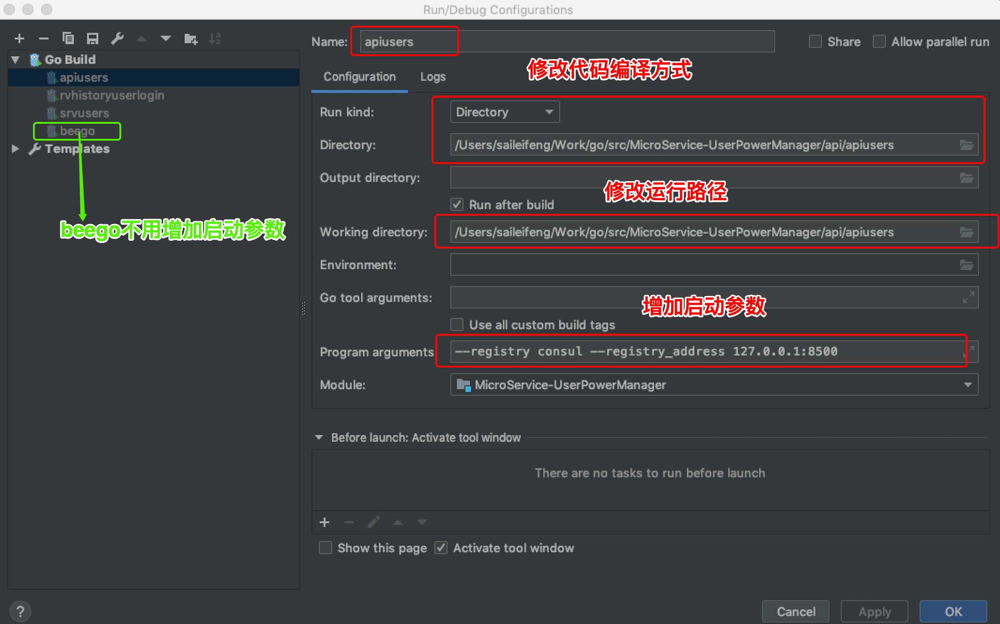

##在goland中运行micro代码

>#####1.配置环境变量并重启电脑让环境变量生效
```bash
# Mysql 的 Host
export DATABASE_SERVER_HOST=192.168.1.198
# Mysql 的 Port
export DATABASE_SERVER_PORT=3306
# Mysql 的 DbName
export DATABASE_SERVER_DBNAME=UserPowerManager
# Mysql 的 UserName
export DATABASE_SERVER_USERNAME=root
# Mysql 的 Pasword
export DATABASE_SERVER_PASSWORD=123456
# Mysql 的 Charset
export DATABASE_SERVER_CHARSET=utf8
# Jaeger 的路径
export JAEGER_AGENTHOSTPORT=127.0.0.1:6831
# 二进制执行文件的前缀
export BUILDPREFIX=mshk
# micro api 的地址
export MICROSERVICE_HOSTPORT=http://localhost:8080
```
>#####2.安装运行jaeger,consul
```bash
docker-compose -f docker-compose-dev.yml up
```

>#####3.安装运行micro
```bash
micro --registry consul --registry_address 127.0.0.1:8500 api --handler=api
```

>#####4.配置goland中run configure

>Done