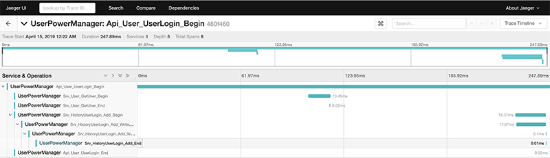

# UserPowerManager

# 用户权限管理
> 使用微服务创建的用户以及权限管理功能 
> 
> 实例中默认您已经安装好 go-micro 环境，关于 go-micro 的环境安装请移步 [这里](https://micro.mu/docs/go-micro.html)

实例中主要有以下功能：
* `jaeger` 来收集分布式服务追踪
* `beego` 做 web 可访问的服务
* `beego ORM` 做为数据库 ORM
* `JWT` 实现了跨域登录
* `logrus` 做日志记录，未来也可以通过 hook 方式记录到其他第三方组件，在输出控制台的同时也会在 `./logs` 目录下，根据日期每天创建一个日志文件。

目录说明：
```
|____log4                           # 日志操作
|____bin                            # 存放 shell 脚本，目前主要用于批量 build
|____swagger                        # swagger 格式的 go-micro 对外提供 API 文档，可以通过 Docker 直接运行
|____Makefile                       # 编译规则文件
|____web                            # Beego 运行的 Web 程序，用于演示如何通过 Web 调用 go-micro 提供的 API
| |____routers
| | |____router.go                      # 路由，在管理后台 `/admin` 的路由加入 Filter 做登录的 token 判断
...
| |____static                           # Beego Web 模板用到的静态文件目录
| |____controllers                      # Beego controllers 目录
...
| | | |____users
| | | | |____UsersController.go         # 后台管理->用户操作的 Controller
| | | |____SiteAuthController.go        # 用户登录、退出的 Controller 
| |____views                            # Beege Web 模板目录
... 
|____utils
| |____inner                        # 内部公共变量的定义，所有的微服务 ID 也在这里定义
| |____jaeger                       # jaeger 第三方包的使用
| |____TConfig.go                   # 对于 config 统一调用 
| |____request                      # 统一封装了 request 请求，目前主要在 Beego Web 中使用
| |____encrypt                      # 加密、解密操作
|____models                         # Beego ORM 用到的数据库映射
|____.env                           # docker-compose 用到的环境变量
|____api                            # 所有对外提供的 go-micro API 可以通过 http 访问的微服务
| |____apiusers                         # 用户增、删、改、查, 登录、验证Token相关操作的API
...
|____data                           # 用到的数据库相关文件夹
| |____insert.sql
| |____UserPowerManager.mwb         # 数据库建模文件
| |____UserPowerManager.sql         # 可以在 Mysql 执行的数据库初始化文件
|____main.go
|____srv                            # 所有的 go-micro Service 微服务
| |____srvusers                         # 用户增、删、改、查相关操作的 Service，包括和数据库交互
...
| |____srvhistoryuserlogin              # 用户登录历史记录的 Service
...
```

## go-micro 环境安装


### 编译安装 Protoc 3.8.0

```
$ wget https://github.com/protocolbuffers/protobuf/releases/download/v3.8.0/protobuf-all-3.8.0.zip
$ unzip protobuf-all-3.8.0.zip
$ cd protobuf-3.8.0

# Mac 编译安装
$ brew install automake libtool autoconf
$ ./autogen.sh
$ ./configure CPPFLAGS=-DGTEST_USE_OWN_TR1_TUPLE=1
$ make && make install

# 查看版本
$ protoc --version
```

### 安装 Go Micro

```
go get github.com/micro/go-micro
```

### 安装 Golang Protobuf
```
$ brew install protobuf
$ go get -u -v github.com/golang/protobuf/{proto,protoc-gen-go}
$ go get -u -v github.com/micro/protoc-gen-micro
```

### 安装 Toolkit

```
go get github.com/micro/micro
```

在项目中初始化相关依赖，需要golang 1.12+
```
$ go mod tidy
```

## 数据库安装

`data/UserPowerManager.mwb` 文件，是使用 [MySQL Workbench](https://www.mysql.com/cn/products/workbench/) 创建的数据库建模。

默认先运行 `data/UserPowerManager.sql` 文件来创建初始的数据库以及表，创建后的数据库名称是 `UserPowerManager`

然后导入 `data/insert.sql` ,会创建默认用户 `admin` 密码是 `admin`

### 生成数据库的 ORM

如果有新的表，可以执行以下命令，来生成数据库 ORM
```
$ bee generate appcode -tables="users" -driver=mysql -conn="root:123456@(localhost:20081)/UserPowerManager?charset=utf8"
```

## 生成 protobuf 文件

执行以下命令，可以自动操作
```
$ make proto
```

## 启动 User 服务 && 测试

编辑 `.env` 文件，**修改数据库的配置**，`docker-compose` 运行时会优先读取 `.env` 中的变量进行替换

使用下面的命令编译所有的微服务
```
$ make build
```

使用下面的命令启动所有的微服务
```
$ make run
```

浏览 http://localhost:18080/v1/admin/users 用户列表页面，默认没有登录，会 302 跳转到登录页面，使用用户名 `admin` 密码 `admin` 登录。

登录成功以后，可以对添加、修改、删除用户。同时浏览 http://localhost:16686 可以看到登录过程中，记录到 `jaeger` 的微服务之间调用关系，如下图：



## swagger 文档查看

官方文档：https://swagger.io/docs/specification/2-0/what-is-swagger/

编译：
```
$ docker-compose build swagger
```

运行以下命令，然后浏览 http://localhost:18081 查看 API 文档
```bash
$ docker-compose up swagger
```


`swagger` 编辑器
```
$ docker run -it --rm -p 80:8080 --name swagger-editor swaggerapi/swagger-editor
```